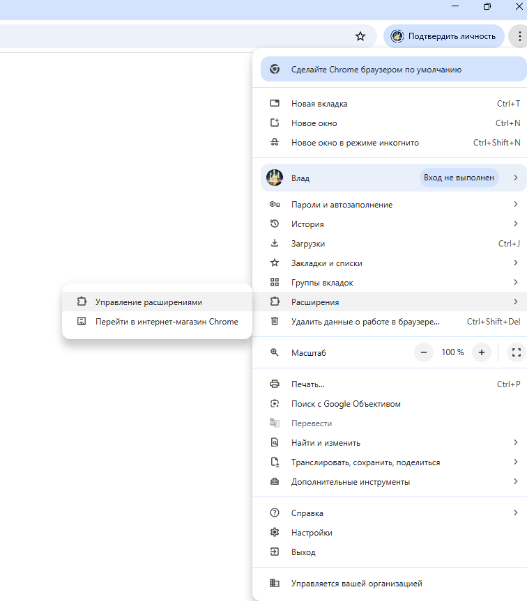
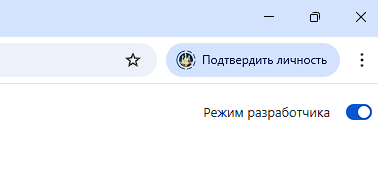
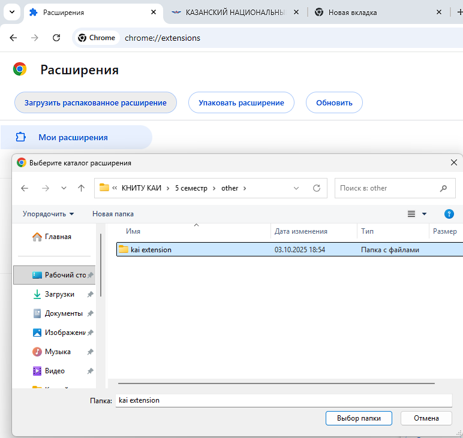
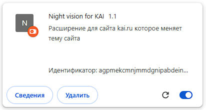
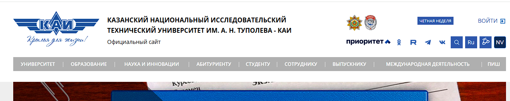
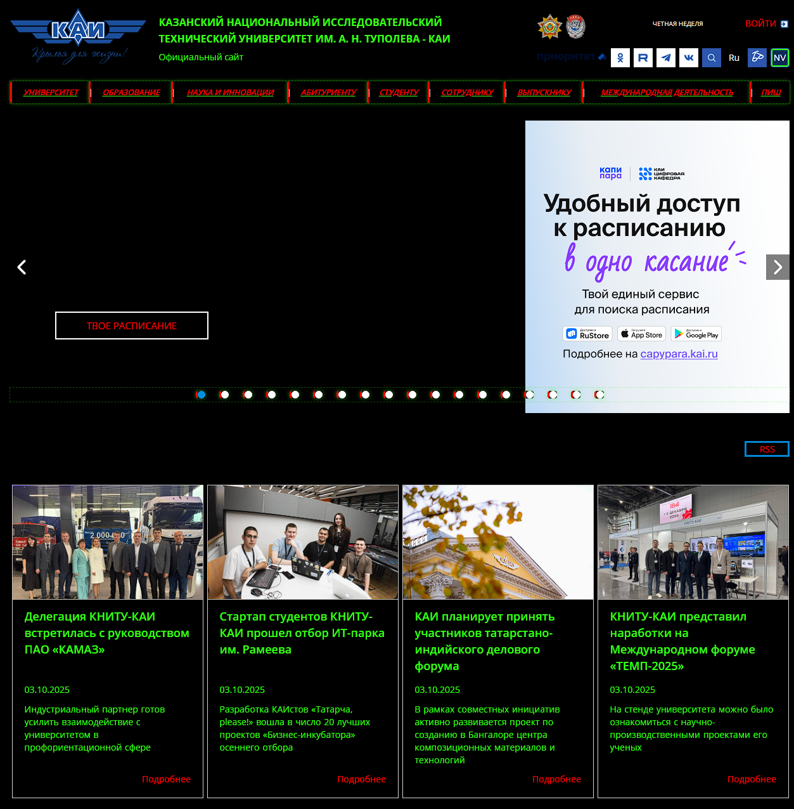
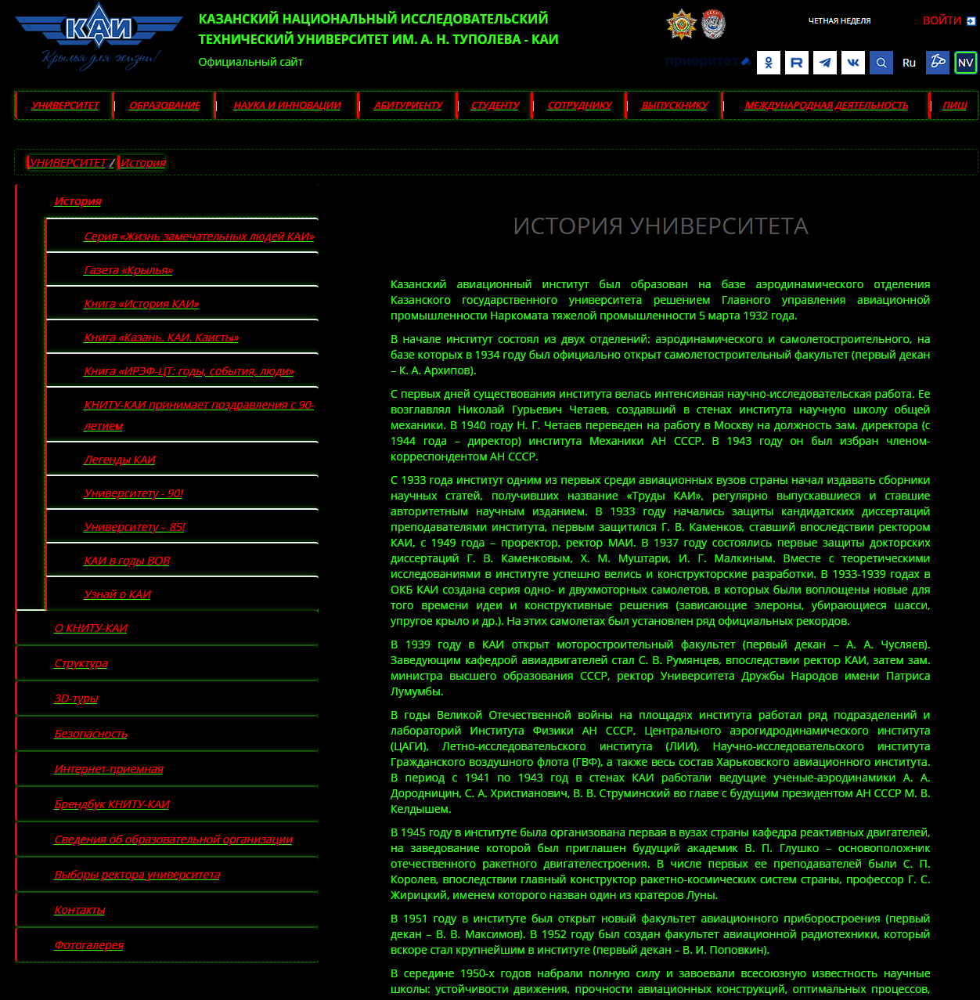

**Моё расширение для браузера chrome которое меняет тему сайта каи на стиль Night Vision(чёрный фон, ярко-зеленый текст (#39ff14), красные ссылки)**

Инструкция по запуску: 
1. Скачать себе локально папку KAI EXTENSION
2. Зайти в браузер chrome
3. Нажать на кнопку "Расширения" -> "Управление расширениями"

4.Включить переключатель "Режим разработчика"

5. Нажать на кнопку "Загрузить распакованное расширение" и выбрать скачанную папку

6.В расширениях появится расширение с названием "Night vision for KAI". Включаем его

7. Переходим на сайт `https://kai.ru/` и в правом верхнем углу, рядом с кнопкой "Режим для слабовидящих" находится кнопка для включения нашего расширения(темы ночного зрения)

8. При нажатии на кнопку меняется тема сайта

9. Работает так же и на подстраницах(других разделах сайта)

